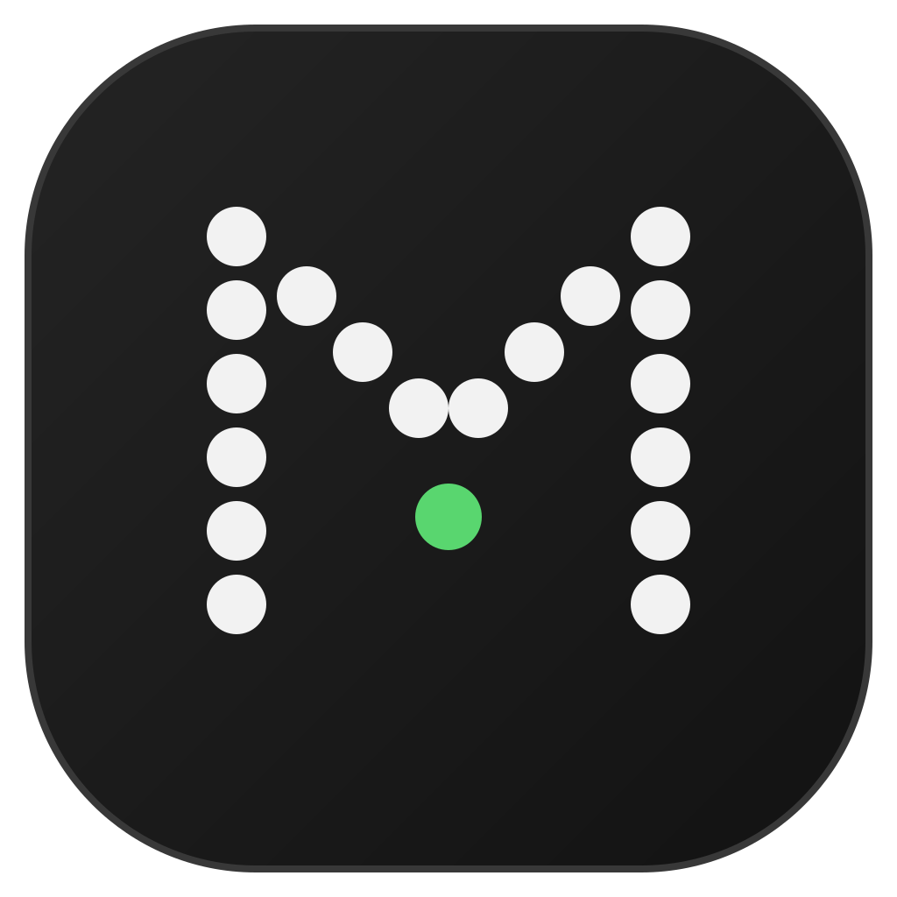
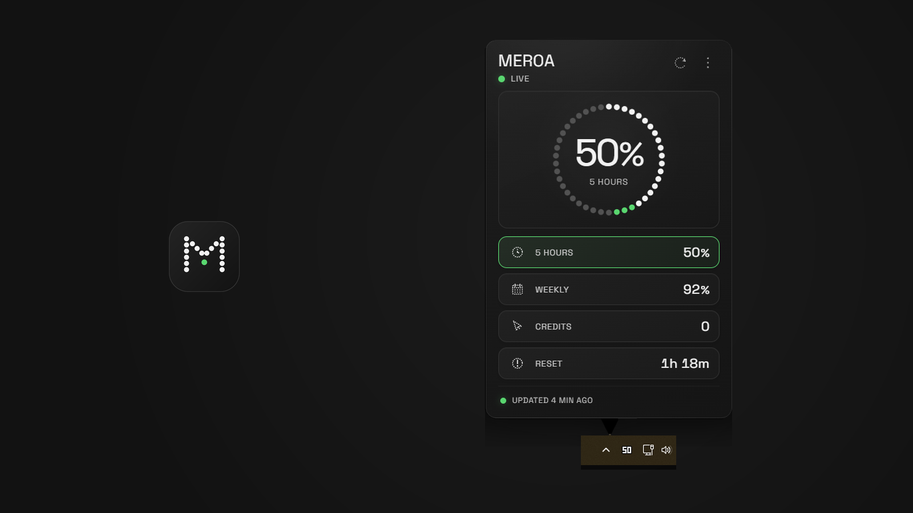
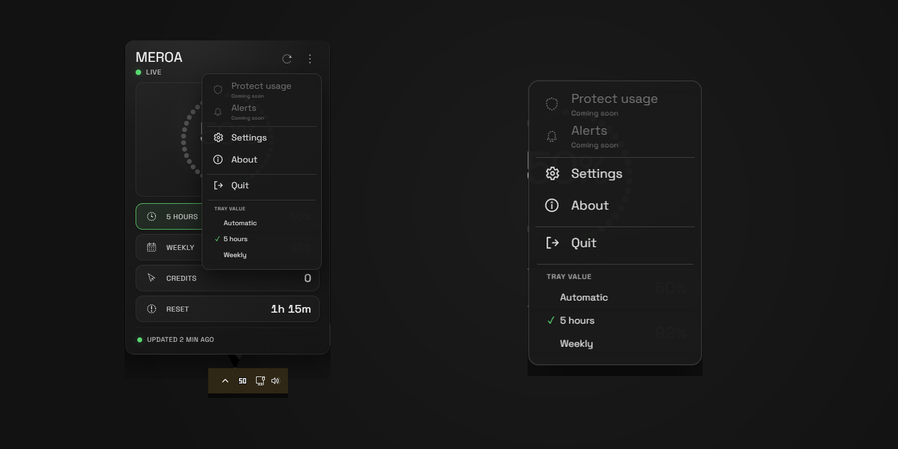

<p align="center">
  
</p>

<h1 align="center">MEROA</h1>

<p align="center">
  <strong>Know what you have.<br>Protect what you need.</strong>
</p>

<p align="center">
  A small Windows tray utility for checking your Codex usage without leaving your work.
</p>

<p align="center">
  <a href="https://github.com/bettomich/meroa/releases/download/v0.1.0/MEROA_0.1.0_x64-setup.exe"><strong>Download for Windows</strong></a>
  ·
  <a href="https://github.com/bettomich/meroa/releases/latest">Latest release</a>
</p>

<p align="center">
  
</p>

## What is MEROA?

MEROA is a local-first, tray-first Windows utility for checking Codex usage.

It shows the information you need in one compact popover:

- 5 Hours
- Weekly
- Credits
- Reset time

No separate dashboard. No MEROA account. Open it from the system tray, check your limits, and continue working.

## See your limits at a glance

MEROA highlights the usage window that matters most and keeps the other values visible underneath it.

Data refreshes automatically. You can also refresh it manually from the popover.

If fresh data is temporarily unavailable, MEROA keeps the last valid values visible and marks them as stale instead of replacing them with misleading information.

## Built for the tray

MEROA starts quietly in the Windows notification area.

The tray indicator can follow the currently limiting window automatically, or you can choose what it displays:

- Automatic
- 5 hours
- Weekly

<p align="center">
  
</p>

Click the tray icon to open the popover. Click outside it to return to your work.

## Private by design

MEROA works locally with the Codex app-server installed on your computer.

No conversations.<br>
No prompts.<br>
No MEROA cloud storage.

MEROA also:

- does not require a MEROA account;
- does not send MEROA telemetry;
- does not read Codex `auth.json` directly;
- does not inspect your source code or documents.

Updater-enabled versions can contact this repository's GitHub Releases to
check for a newer signed installer. This does not add a MEROA backend,
telemetry, or account. See the [updater architecture](docs/UPDATER.md).

Codex may still use its normal network connection when providing usage data. MEROA does not add another cloud service between you and Codex.

Read the full [privacy note](PRIVACY.md) and the [data-source documentation](docs/CODEX_USAGE_SOURCE.md).

## Download

### MEROA 0.1.0

[Download the Windows x64 installer](https://github.com/bettomich/meroa/releases/download/v0.1.0/MEROA_0.1.0_x64-setup.exe)

You can also view the [release notes](https://github.com/bettomich/meroa/releases/tag/v0.1.0), [build information](release/BUILD_INFO.md), and [SHA-256 checksum](release/SHA256SUMS.txt).

## Installation

1. Download `MEROA_0.1.0_x64-setup.exe`.
2. Open the installer.
3. Launch MEROA.
4. Find the MEROA indicator in the Windows notification area.
5. Click the indicator to open the popover.

Windows may initially place MEROA under the hidden icons arrow (`^`).

You can enable **Start with Windows** from Settings.

## Windows SmartScreen

MEROA 0.1.0 is not code-signed yet. Windows SmartScreen may therefore show a warning when you open the installer.

If you downloaded MEROA from this repository:

1. select **More info**;
2. confirm that the file is `MEROA_0.1.0_x64-setup.exe`;
3. optionally verify its SHA-256 checksum;
4. select **Run anyway**.

Do not bypass the warning for installers downloaded from unofficial sources.

## Requirements

- Windows 10 or Windows 11
- x64 system
- Codex installed and authenticated

MEROA does not require an API key or a separate MEROA login.

## Roadmap

Available in 0.1.0:

- Codex 5 Hours, Weekly, Credits, and Reset values
- automatic and manual refresh
- dynamic tray indicator
- Automatic, 5 hours, and Weekly tray modes
- stale-data handling
- English and Italian interface
- optional Windows autostart
- single-instance behaviour

Planned:

- Reserve
- Pace
- usage alerts
- local usage history

Reserve and Pace are planning tools. They will not modify or block the limits provided by Codex.

## Technical / Development

MEROA is built with:

- Tauri 2
- React
- TypeScript
- Rust

The Codex integration is isolated from the interface and communicates with the locally installed Codex app-server.

### Run locally

```powershell
npm install
npm run tauri:dev
```

### Verify the project

```powershell
npm test
npm run build
npm run tauri:build
```

See [Codex usage source](docs/CODEX_USAGE_SOURCE.md) for details about the data boundary and normalization.
